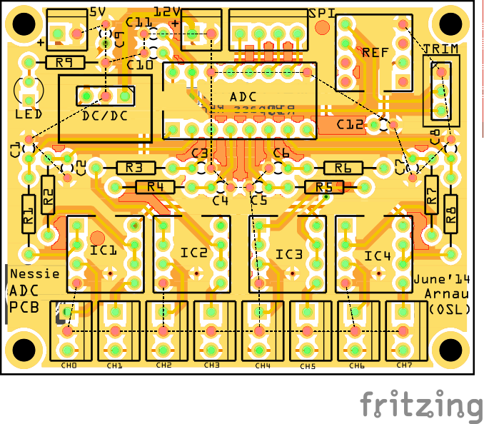

OSL ADC Board
=============

The __OSL ADC board__ is a small standalone 2-layer pcb design for extending the A/D conversion capability of a single Arduino Board often used in small robotics projects.

The following layout ([fritzing file](adc_board_final.fzz)) is taken as reference while the ADC chip can be choosen between the MCP3208 (12-bit) and the MCP3008 (10-bit) with SPI serial bus interface. 

The main features are the integrated +5V DC/DC converter, allowing this board to be used directly on a 12V power bus, the on-board trimmable precision voltage reference, with allows flexible acquisitions (both 0-5V and 0-3.3V voltage ranges are supported), the 5V output for daisy-chain operations and the option of bypassing the voltage reference using a resistor pad in the bottom side of the board. This board has been designed together with Arnau Puig Mensa.

### Components

* 1 x MCP3208 A/D converter with SPI interface (12-bit)
* 1 x TI REF-02 precision voltage reference (+5V)
* 4 x TI OPA2340 single-supply, rail-to-rail, operational amplifier
* 1 x TSR1-2450 voltage regulator

For a more detailed list look at [the bill of materials](docs/adc_board_final_bom.html) in the [docs](docs) dir.

## References

* [Microchip MCP3208](http://www.microchip.com/wwwproducts/Devices.aspx?dDocName=en010534)
* [Arduino Playground MCP3208](http://playground.arduino.cc/Code/MCP3208)
* [TI OPA2340](http://www.ti.com/product/opa2340)
* [TI REF-02](http://www.ti.com/product/ref02)

## LICENSE - "MIT License"

Copyright (c) 2012-2013 Valerio De Carolis, http://decabyte.it

Permission is hereby granted, free of charge, to any person
obtaining a copy of this software and associated documentation
files (the "Software"), to deal in the Software without
restriction, including without limitation the rights to use,
copy, modify, merge, publish, distribute, sublicense, and/or sell
copies of the Software, and to permit persons to whom the
Software is furnished to do so, subject to the following
conditions:

The above copyright notice and this permission notice shall be
included in all copies or substantial portions of the Software.

THE SOFTWARE IS PROVIDED "AS IS", WITHOUT WARRANTY OF ANY KIND,
EXPRESS OR IMPLIED, INCLUDING BUT NOT LIMITED TO THE WARRANTIES
OF MERCHANTABILITY, FITNESS FOR A PARTICULAR PURPOSE AND
NONINFRINGEMENT. IN NO EVENT SHALL THE AUTHORS OR COPYRIGHT
HOLDERS BE LIABLE FOR ANY CLAIM, DAMAGES OR OTHER LIABILITY,
WHETHER IN AN ACTION OF CONTRACT, TORT OR OTHERWISE, ARISING
FROM, OUT OF OR IN CONNECTION WITH THE SOFTWARE OR THE USE OR
OTHER DEALINGS IN THE SOFTWARE.
